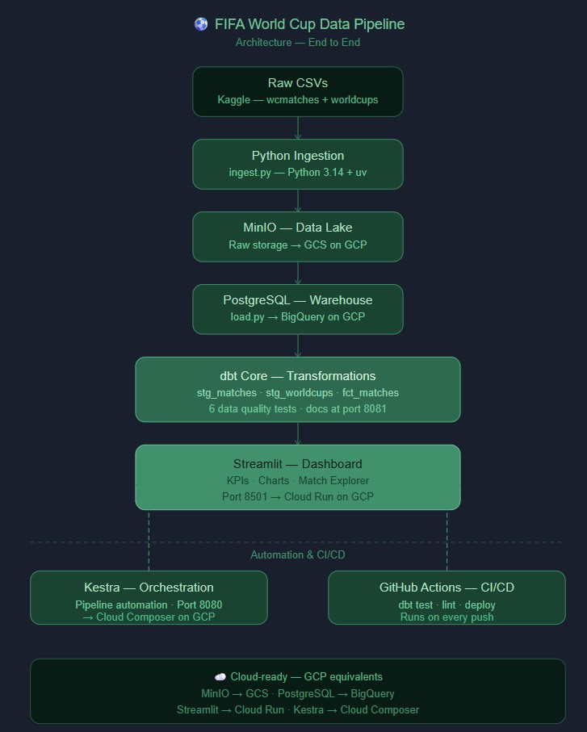
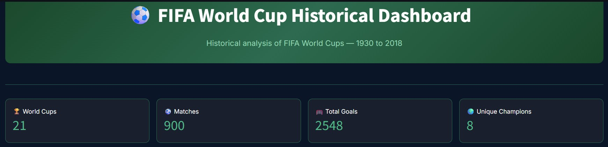
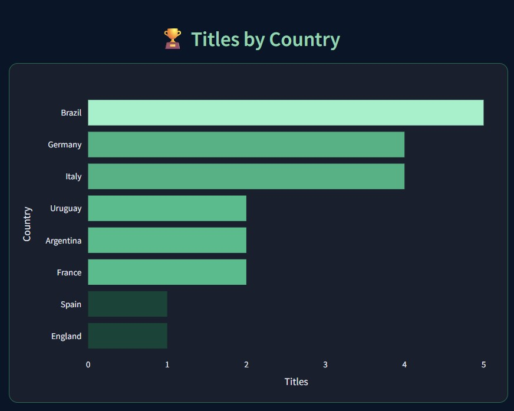
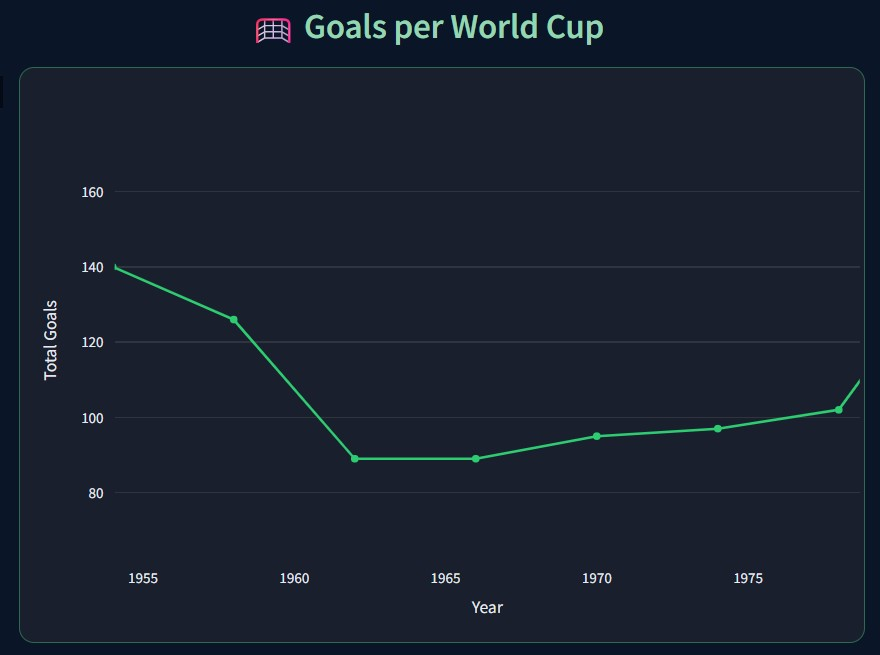
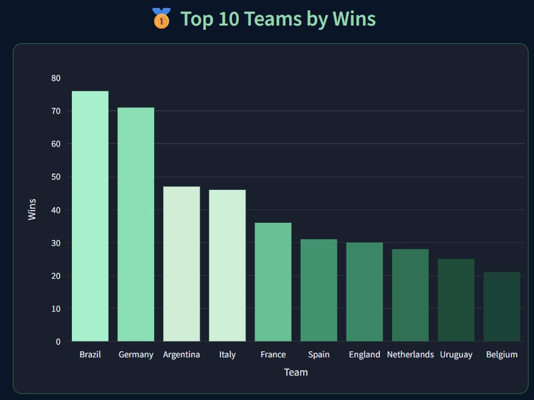
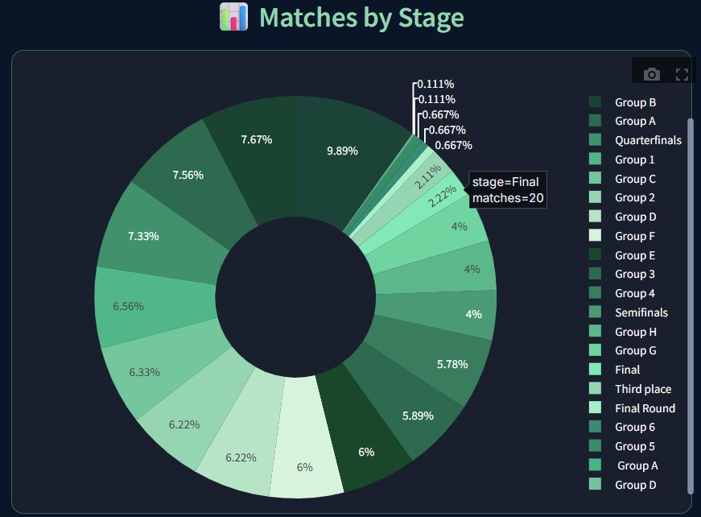
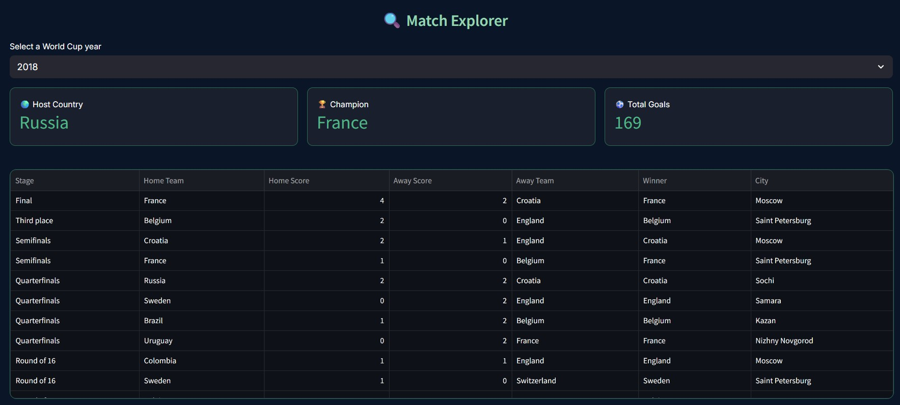

# ⚽ FIFA World Cup Data Pipeline

> An end-to-end data engineering project that ingests, processes and visualizes FIFA World Cup historical data (1930–2018).


---

## 📌 Problem Statement

Modern organizations receive data from multiple sources in different formats, but lack automated pipelines to reliably ingest, store, transform and visualize that data.

This project solves that problem by building a **complete data pipeline** that takes raw FIFA World Cup data and turns it into meaningful insights through an interactive dashboard — with full automation, reproducibility and clear documentation.

---

## 🎯 Objective

Build a production-ready, end-to-end data pipeline that:

- Ingests raw CSV data into a **Data Lake**
- Loads and structures data in a **Data Warehouse**
- Transforms data using **dbt**
- Visualizes insights in an interactive **Dashboard**
- Orchestrates all steps automatically with **Kestra**
- Automates testing and deployment with **GitHub Actions**

---

## 🏗️ Architecture



---

## 🛠️ Tech Stack

| Tool | Purpose | Local | GCP Equivalent |
|---|---|---|---|
| **Python 3.14** | Data ingestion scripts | ✅ | ✅ |
| **uv** | Package & environment manager | ✅ | ✅ |
| **Docker + Compose** | Containerization | ✅ | Cloud Run |
| **MinIO** | Data Lake | ✅ | Google Cloud Storage |
| **PostgreSQL 16** | Data Warehouse | ✅ | BigQuery |
| **dbt Core 1.11** | Data transformations | ✅ (postgres) | dbt + BigQuery |
| **Kestra** | Pipeline orchestration | ✅ | Kestra / Cloud Composer |
| **Streamlit** | Dashboard | ✅ | Cloud Run |
| **GitHub Actions** | CI/CD | ✅ | ✅ |
| **pgAdmin 4** | Database UI | ✅ | — |

> 💡 This project is designed to be cloud-ready. Each local tool maps directly to a GCP equivalent with minimal configuration changes.

---

## 📊 Dataset

**Source:** [FIFA World Cup — Kaggle](https://www.kaggle.com/datasets/evangower/fifa-world-cup)

Two CSV files covering every World Cup from **Uruguay 1930** to **Russia 2018**:

| File | Rows | Description |
|---|---|---|
| `wcmatches.csv` | 900+ | Every match played — teams, scores, stages, dates, outcomes |
| `worldcups.csv` | 21 | Summary per tournament — winner, goals, attendance, teams |

> ⚠️ Data files are not included in this repository. Download them from Kaggle and place them in `data/raw/`.

---

## 📁 Project Structure

```
fifa-worldcup-data-pipeline/
│
├── data/
│   ├── raw/                       ← Downloaded CSVs (not tracked by git)
│   └── processed/                 ← Transformed data
│
├── ingestion/
│   └── ingest.py                  ← Uploads raw CSVs to MinIO Data Lake
│
├── warehouse/
│   └── load.py                    ← Creates tables and loads data into PostgreSQL
│
├── transform/
│   ├── Dockerfile                 ← dbt container (Python 3.12 + dbt-postgres)
│   ├── profiles.yml               ← dbt connection config (local: postgres / GCP: bigquery)
│   └── fifa_pipeline/             ← dbt project
│       ├── models/
│       │   ├── staging/           ← stg_matches, stg_worldcups (views — clean raw data)
│       │   └── facts/             ← fct_matches (table — enriched, ready for dashboard)
│       ├── tests/                 ← Data quality tests
│       ├── macros/                ← Reusable SQL macros
│       └── dbt_project.yml        ← dbt project config
│
├── orchestration/                 ← Kestra pipeline configuration
├── dashboard/
│   ├── app.py                     ← Streamlit entry point
│   ├── Dockerfile                 ← Dashboard container
│   ├── styles/main.css            ← Global dark theme styles
│   ├── db/queries.py              ← PostgreSQL connection and queries
│   └── components/
│       ├── metrics.py             ← KPI cards
│       ├── charts.py              ← All chart visualizations
│       └── explorer.py            ← Interactive match explorer
│
├── docs/                          ← Screenshots and architecture diagram
├── .github/workflows/             ← GitHub Actions CI/CD
├── docker-compose.yaml            ← All services: MinIO, PostgreSQL, Kestra, pgAdmin, dbt, Streamlit
├── pyproject.toml                 ← Python dependencies (uv)
├── .gitignore
├── README.md
└── LICENSE
```

---

## 🚀 How to Run

### Prerequisites
- [Docker Desktop](https://www.docker.com/products/docker-desktop/) installed
- [Python 3.14+](https://www.python.org/downloads/) installed
- [uv](https://docs.astral.sh/uv/) installed

### Steps

```bash
# 1. Clone the repository
git clone https://github.com/Ariel-10/fifa-worldcup-data-pipeline.git
cd fifa-worldcup-data-pipeline

# 2. Install dependencies
uv sync

# 3. Download the dataset from Kaggle and place CSVs in data/raw/

# 4. Start all services
docker compose up -d

# 5. Run ingestion — uploads CSVs to MinIO Data Lake
uv run ingestion/ingest.py

# 6. Run warehouse load — creates tables and loads data into PostgreSQL
uv run warehouse/load.py

# 7. Run dbt transformations — creates staging views and fct_matches table
docker compose run dbt dbt run --project-dir fifa_pipeline

# 8. Run dbt tests — validates data quality
docker compose run dbt dbt test --project-dir fifa_pipeline

# 9. Start Streamlit dashboard
docker compose up streamlit

# 10. (Optional) Generate and serve dbt documentation
docker compose run dbt dbt docs generate --project-dir fifa_pipeline
docker compose run --service-ports dbt dbt docs serve --project-dir fifa_pipeline --host 0.0.0.0 --port 8081
```

### Services

| Service | URL | Credentials |
|---|---|---|
| **Streamlit Dashboard** | http://localhost:8501 | no login required |
| MinIO UI | http://localhost:9001 | user: `root` / pass: `rootroot` |
| Kestra UI | http://localhost:8080 | set on first login |
| pgAdmin | http://localhost:5050 | email: `admin@admin.com` / pass: `root` |
| dbt docs | http://localhost:8081 | no login required |

---

## 📈 Dashboard

Interactive dashboard built with Streamlit — reads directly from `fct_matches` in PostgreSQL.

### KPI Metrics


### Titles by Country


### Goals per World Cup


### Top 10 Teams by Wins


### Matches by Stage


### Match Explorer


---

## 🗺️ Roadmap

- [x] Project structure defined
- [x] Dataset selected
- [x] Docker Compose — MinIO + PostgreSQL + Kestra + pgAdmin + dbt + Streamlit
- [x] Python ingestion script — CSVs uploaded to MinIO
- [x] PostgreSQL warehouse tables — `raw_worldcups` and `raw_matches` loaded
- [x] dbt project initialized — connected to PostgreSQL
- [x] dbt models — `stg_matches`, `stg_worldcups`, `fct_matches`
- [x] dbt tests — 6 data quality checks passing
- [x] dbt documentation — auto-generated with lineage, served at localhost:8081
- [x] Streamlit dashboard — interactive visualizations with dark theme
- [x] Data quality fixes — West Germany → Germany unified, draws handled
- [ ] Full orchestration with Kestra
- [ ] GitHub Actions CI/CD
- [ ] README final documentation with screenshots

---

## 👤 Author

**Ariel Ortega**
Data Engineering — Personal Portfolio Project

---

## 📄 License

This project is licensed under the MIT License. See [LICENSE](LICENSE) for details.
