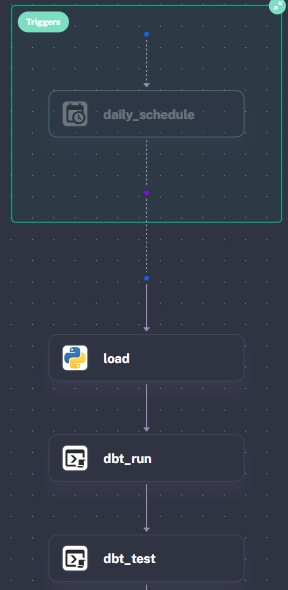
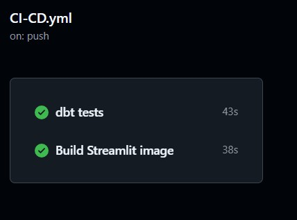

# FIFA World Cup Data Pipeline

> A full data pipeline that loads, transforms and visualizes FIFA World Cup data from 1930 to 2018.


---

## Problem Statement

The organizations usually get data from a lot of sources in different formats but they do not have automated and reliable pipelines to ingest, store, transform and visualize the data.

Then, this project solves that problem because we built a full data pipeline that it takes raw FIFA World Cup data and it tranforms to meaningful insights with an interactive dashboard, all of these with a full automation and clear documentation.

---

## Objective

The goal of this project is to create a reliable data pipeline that it can manage everything from raw files to build a dashboard, so it can be done with the next points:

- Ingests raw CSV data in a **Data Lake**
- Loads and organize data in a **Data Warehouse**
- Transforms data with **dbt**
- Runs all steps with **Kestra**
- Shows the results in an interactive **Dashboard**
- Testing and deployment with **GitHub Actions**

---

## Architecture


> The local setup works almost the same as the GCP services and each tool has a cloud equivalent, so moving to GCP only needs a few changes in the config.
---

## Tech Stack

| Tool | Purpose | Local | GCP Equivalent |
|---|---|---|---|
| **Python 3.14** | Data ingestion scripts | Yes | Yes |
| **uv** | Package manager | Yes | Yes |
| **Docker + Compose** | Containerization | Yes | Cloud Run |
| **MinIO** | Data Lake | Yes | Google Cloud Storage |
| **PostgreSQL 16** | Data Warehouse | Yes | BigQuery |
| **dbt Core 1.11** | Transformations | Yes (postgres) | dbt + BigQuery |
| **Kestra** | Pipeline orchestration | Yes | Kestra / Cloud Composer |
| **Streamlit** | Dashboard | Yes | Cloud Run |
| **GitHub Actions** | CI/CD | Yes | Yes |
| **pgAdmin 4** | Database UI | Yes | — |

---

## Dataset

**Source:** [FIFA World Cup - Kaggle](https://www.kaggle.com/datasets/evangower/fifa-world-cup)

This dataset has two CSV files with all World Cups from Uruguay 1930 to Russia 2018:

| File | Rows | Description |
|---|---|---|
| `wcmatches.csv` | 900+ | All matches — teams, scores, stages, dates, outcomes |
| `worldcups.csv` | 21 | Summary per tournament — winner, goals, attendance, teams |

> The CSV files are not in this repo, so you need to download them from Kaggle and put them in data/raw/. 

---

## Project Structure

This is the structure of the project, so each folder has a role in the pipeline from the raw files to the dashboard.

```
fifa-worldcup-data-pipeline/
│
├── data/
│   ├── raw/                       ← Downloaded CSVs (not tracked by git)
│   └── processed/                 ← Transformed data
│
├── ingestion/
│   └── ingest.py                  ← Uploads raw CSVs to MinIO Data Lake
│
├── warehouse/
│   └── load.py                    ← Creates tables and loads data into PostgreSQL
│
├── transform/
│   ├── Dockerfile                 ← dbt container (Python 3.12 + dbt-postgres)
│   ├── profiles.yml               ← dbt connection config (local: postgres / GCP: bigquery)
│   └── fifa_pipeline/             ← dbt project
│       ├── models/
│       │   ├── staging/           ← stg_matches, stg_worldcups (clean raw data)
│       │   └── facts/             ← fct_matches (final table for the dashboard)
│       ├── tests/                 ← Data quality tests
│       ├── macros/                ← Reusable SQL macros
│       └── dbt_project.yml        ← dbt project config
│
├── orchestration/
│   └── fifa_pipeline.yml          ← Kestra flow (load → dbt run → dbt test)
│
├── dashboard/
│   ├── app.py                     ← Streamlit entry point
│   ├── Dockerfile                 ← Dashboard container
│   ├── styles/main.css            ← Dark theme styles
│   ├── db/queries.py              ← PostgreSQL connection and queries
│   └── components/
│       ├── metrics.py             ← KPI cards
│       ├── charts.py              ← Chart visualizations
│       └── explorer.py            ← Match explorer
│
├── docs/                          ← Screenshots and architecture diagram
├── .github/workflows/
│   └── ci-cd.yml                  ← CI: dbt compile / CD: Streamlit image build
├── docker-compose.yaml            ← All services (MinIO, PostgreSQL, Kestra, dbt, Streamlit)
├── pyproject.toml                 ← Python dependencies (uv)
├── .gitignore
├── README.md
└── LICENSE
```

---

## How to Run

### Prerequisites

Make sure that you have installed these before running the project:

- [Docker Desktop](https://www.docker.com/products/docker-desktop/)
- [Python 3.14+](https://www.python.org/downloads/)
- [uv](https://docs.astral.sh/uv/)

### Steps

Here are the steps to run the project:

```bash
# 1. Clone the repository
git clone https://github.com/Ariel-10/fifa-worldcup-data-pipeline.git
cd fifa-worldcup-data-pipeline

# 2. Install dependencies
uv sync

# 3. Download the dataset from Kaggle and put the CSVs in data/raw/

# 4. Start all services
docker compose up -d

# 5. Run ingestion — uploads CSVs to MinIO Data Lake (once)
uv run ingestion/ingest.py

# 6. Open Kestra at http://localhost:8080 and trigger the fifa_pipeline flow
#    This runs: load → dbt run → dbt test

# 7. Start Streamlit dashboard
docker compose up streamlit
```

### Optional — Manual steps (without Kestra)

```bash
# Run warehouse load
uv run warehouse/load.py

# Run dbt transformations
docker compose run dbt dbt run --project-dir fifa_pipeline

# Run dbt tests
docker compose run dbt dbt test --project-dir fifa_pipeline

# Optional: Generate dbt documentation
docker compose run dbt dbt docs generate --project-dir fifa_pipeline
docker compose run --service-ports dbt dbt docs serve --project-dir fifa_pipeline --host 0.0.0.0 --port 8081
```

### Services

| Service | URL | Credentials |
|---|---|---|
| **Streamlit Dashboard** | http://localhost:8501 | no login needed |
| **Kestra UI** | http://localhost:8080 | set on first login |
| **MinIO UI** | http://localhost:9001 | user: `root` / pass: `rootroot` |
| pgAdmin | http://localhost:5050 | email: `admin@admin.com` / pass: `root` |
| dbt docs | http://localhost:8081 | no login needed |

---

## Orchestration

The pipeline is managed with Kestra. After that the CSV files are uploaded to MinIO (just once and it is manual), the `fifa_pipeline` flow in Kestra will automatically do:

```
load → dbt run → dbt test
```

Each task runs in its own Docker container and it pulls the latest code from GitHub on every execution, so the pipeline always uses the most recent version.



> Credentials are hardcoded for local development but they would be stored as **Kestra Secrets** in production.

---

## CI/CD

Every `git push` to `main`, **GitHub Actions** runs two jobs: 

| Job | What it does | Production equivalent |
|---|---|---|
| **dbt tests** | Runs `dbt compile` to check SQL syntax against a temporary PostgreSQL instance | `dbt test` on a staging database |
| **Build Streamlit image** | Builds the dashboard Docker image to make sure the `Dockerfile` and dependencies are correct | `docker push` + `gcloud run deploy` |



> Credentials are hardcoded for local development but they would be stored as **GitHub Secrets** and it can be used like `${{ secrets.POSTGRES_PASSWORD }}` in production. 
---

## Cloud Migration Path

This project is built in a way that it can be easy to move to GCP, so if we want to do it, we should change a few things in the config but the code would be the same.

| Component | Local | GCP | Change needed |
|---|---|---|---|
| Data Lake | MinIO | Google Cloud Storage | Update connection string and credentials |
| Data Warehouse | PostgreSQL 16 | BigQuery | Update `profiles.yml` target to `bigquery` |
| Orchestration | Kestra (local) | Kestra Cloud / Cloud Composer | Point to the managed instance |
| Dashboard | Streamlit (local) | Cloud Run | Build the image and deploy |
| Scripts | `localhost` defaults | env vars already configured | Set env vars in Cloud Run |

> As we know, `ingest.py` and `load.py` use environment variables, so we don’t need to change the code when we move from local to  cloud.

---

## Dashboard

Interactive dashboard built with Streamlit and it reads directly from `fct_matches` in PostgreSQL.

### KPI Metrics


### Titles by Country


### Goals per World Cup


### Top 10 Teams by Wins


### Matches by Stage


### Match Explorer


---

## Roadmap

- [x] Project structure defined
- [x] Dataset selected
- [x] Docker Compose — MinIO, PostgreSQL, Kestra, pgAdmin, dbt and Streamlit
- [x] Python ingestion script — CSVs uploaded to MinIO
- [x] PostgreSQL warehouse tables — `raw_worldcups` and `raw_matches` loaded
- [x] dbt project initialized — connected to PostgreSQL
- [x] dbt models — `stg_matches`, `stg_worldcups` and `fct_matches`
- [x] dbt tests — 6 data quality checks passing
- [x] dbt documentation — generated and running at localhost:8081
- [x] Streamlit dashboard — interactive charts with dark theme
- [x] Data quality fixes — West Germany → Germany unified and draws handled
- [x] Kestra orchestration — automated flow: load → dbt run → dbt test
- [x] GitHub Actions CI/CD — dbt compile and Streamlit image build on every push
- [x] README screenshots — Kestra flow and GitHub Actions run

---

## Author

**Ariel Ortega**
Data Engineering — Personal Portfolio Project

---

## License

This project is licensed under the MIT License. See [LICENSE](LICENSE) for details.
